# copilot-base: how it works

A guided tour of the toolkit for someone meeting it for the first time: what it
is for, what it installs, what happens when a session starts, and how the pieces
fit. Every claim here is taken from the code in this repository, and each section
points at the file that implements it.

**Companion documents**

| If you want to... | Read |
|---|---|
| Install it and make one real change in fifteen minutes | [getting-started.md](getting-started.md) |
| Pick the right workflow for a piece of work | [workflows.md](workflows.md) |
| Understand the reasoning and the trade-offs | [multi-agent-playbook.md](multi-agent-playbook.md) |
| Know what Copilot CLI already ships, so you do not rebuild it | [copilot-cli-capabilities.md](copilot-cli-capabilities.md) |
| Change the toolkit itself | [../CONTRIBUTING.md](../CONTRIBUTING.md), [../AGENTS.md](../AGENTS.md) |

---

## Contents

1. [In one page](#1-in-one-page)
2. [The problem it solves](#2-the-problem-it-solves)
3. [Architecture at a glance](#3-architecture-at-a-glance)
4. [What the installer does](#4-what-the-installer-does)
5. [A session, step by step](#5-a-session-step-by-step)
6. [Building block: roles (agents)](#6-building-block-roles-agents)
7. [Building block: workflows (skills)](#7-building-block-workflows-skills)
8. [Building block: guardrails (hooks)](#8-building-block-guardrails-hooks)
9. [Building block: orchestration scripts](#9-building-block-orchestration-scripts)
10. [Where state lives, and how facts are resolved](#10-where-state-lives-and-how-facts-are-resolved)
11. [Parallel work: fleet, fan-out and waves](#11-parallel-work-fleet-fan-out-and-waves)
12. [Delivery: how work leaves the machine](#12-delivery-how-work-leaves-the-machine)
13. [Safety guarantees](#13-safety-guarantees)
14. [How it is tested](#14-how-it-is-tested)
15. [The adoption ladder](#15-the-adoption-ladder)
16. [Command cheat sheet](#16-command-cheat-sheet)
17. [Glossary](#17-glossary)

---

## 1. In one page

**copilot-base** is a machine-level toolkit for GitHub Copilot CLI. You install
it once into `~/.copilot`, and from then on every repository you open gets:

- **Roles** - ten specialised agents you can call with `@name` (`@tech-lead`,
  `@implementer`, `@critic`, ...), each with a pinned model, effort level and
  tool boundary.
- **Workflows** - seven skills that orchestrate those roles. The main one,
  `crew`, takes a plain-English request such as *"implement user story ABS-312"*
  all the way to verified commits on a branch.
- **Guardrails** - six hooks the CLI runs itself, regardless of what the model
  decides: no commits to `main`, no edits to protected files, the project's
  check runs after every edit, and a subagent cannot say "done" while that
  check is red.
- **Orchestration** - plain Node scripts for the things the CLI does not do:
  a repository registry, parallel slices in isolated git worktrees, dependency
  waves across repositories, and long-lived supervised sessions.

There is no runtime, no build step and no dependency. It is Markdown plus Node
scripts, and it never writes anything into your work repositories except
branches and commits.

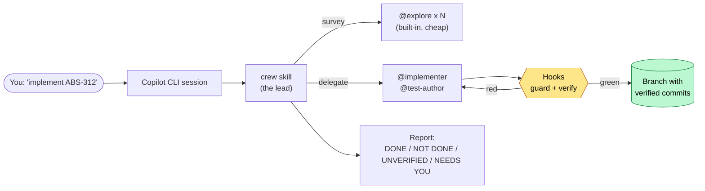

---

## 2. The problem it solves

Copilot CLI gives you one capable agent per session. Past a certain size of
work, that agent hits the same four walls every time. Each part of this toolkit
exists to take one of them down.

| Wall | What it looks like | What copilot-base adds | Where |
|---|---|---|---|
| **Context fills up** | The agent re-reads files it already read, or contradicts itself | Roles that delegate the *reading* and keep only the answer | `crew` step 2, `@explore`, `@impact-scout` |
| **"Done" is a claim** | The agent says the tests pass. They do not. | A per-repository check run by a hook the model cannot skip | `verify-after-edit`, `guard-subagent-done` |
| **Parallel work collides** | Two agents edit one file in one tree; both are now wrong | A gate that refuses overlapping file sets, and a worktree per slice | `scripts/fanout.mjs` |
| **One change, five services** | The provider ships; a consumer nobody listed breaks in production | Cross-repo impact search, one contract, dependency waves, ordered rollout | `@impact-scout`, `multi-repo`, `@rollout` |

If none of these hurts yet, install it for the guardrails and stop there. That
is stage 0 of the [adoption ladder](#15-the-adoption-ladder), and most people
should sit on it for a while.

---

## 3. Architecture at a glance

Four kinds of thing, each with a clear job, and one rule about who may read
what.

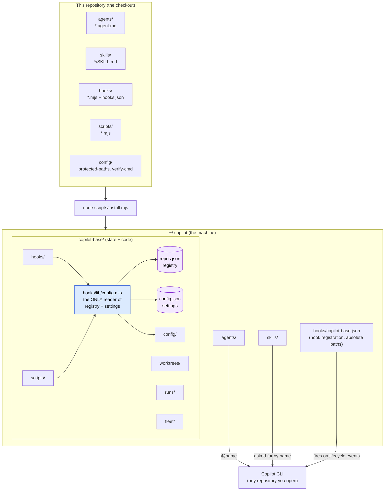

**Why roles are agents and workflows are skills.** A skill loads into the *main*
agent's context, so it can spawn and coordinate subagents. An agent *is* a
subagent, and a subagent orchestrating subagents is not something to bet on.
This is the one structural rule that decides where a new piece goes
([CONTRIBUTING.md](../CONTRIBUTING.md#how-the-pieces-are-meant-to-divide)).

**Why there is one config reader.** Hooks fire in every repository on the
machine, including ones you do not own. Everything repository-specific
therefore has to come from a registry that lives *outside* the repositories,
and exactly one module, [hooks/lib/config.mjs](../hooks/lib/config.mjs),
decides where each fact comes from. Hooks and scripts ask it; nothing else
reads the registry or guesses a path.

---

## 4. What the installer does

[scripts/install.mjs](../scripts/install.mjs) copies files (it does not link
them, because file symlinks on Windows need elevation) and records every
destination in a manifest so uninstall is exact.

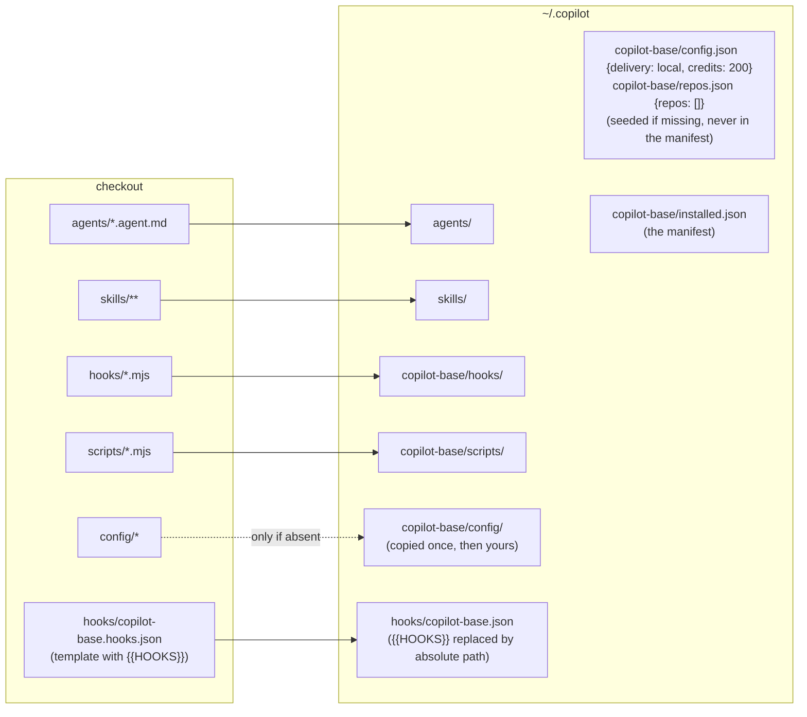

Three details that matter:

- **Hook commands are not tilde-expanded** by the CLI, so the registration file
  must carry absolute paths. The installer substitutes them in.
- **Scripts are installed beside the hooks** because they import
  `../hooks/lib/config.mjs`; the installed layout mirrors the checkout. Every
  skill writes commands as `node <base>/scripts/...`, where `<base>` is
  `~/.copilot/copilot-base`. The session brief prints the real path so nobody
  has to guess.
- **Settings and the registry are never in the manifest.** They become yours
  the moment they exist. `--uninstall` leaves them alone; only
  `--uninstall --purge` removes them.

```bash
node scripts/install.mjs --dry-run     # list every file it would write, write none
node scripts/install.mjs               # install or update
node scripts/install.mjs --uninstall   # remove exactly what was written
```

---

## 5. A session, step by step

This is what actually happens when you open a terminal in the folder that holds
your projects, run `copilot`, and type *"implement user story ABS-312"*.

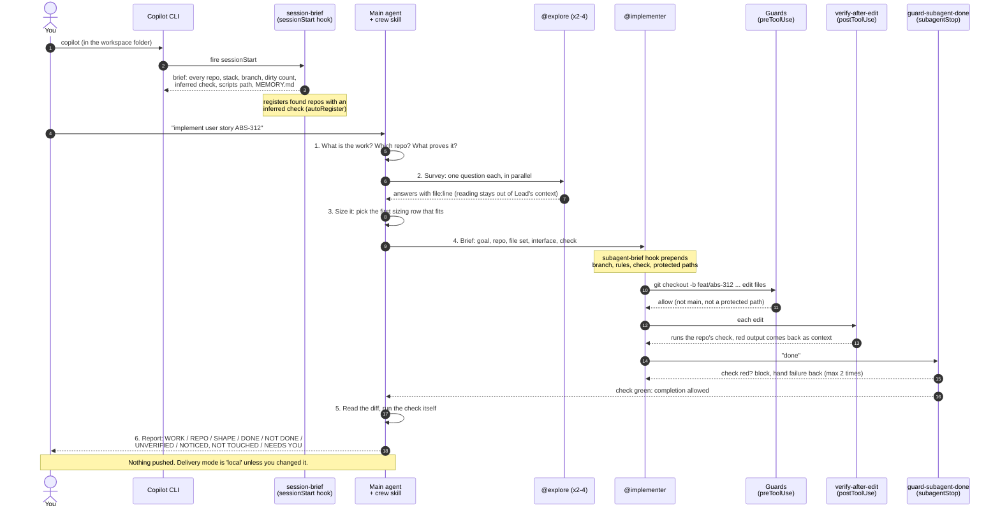

The parts worth remembering:

- **Step 2 is not optional.** Every run surveys through `@explore` before it
  sizes anything. The survey is the stage that reads the most and keeps the
  least, so it is paid for out of a cheap subagent's context, not the lead's.
- **Step 3 decides two things separately:** how much planning, and who types.
  A subagent types by default. The lead writes code itself only when the brief
  would be longer than the diff (a one-liner, a rename, a version bump).
- **Step 5 is where the lead stops believing reports.** It reads the diff and
  runs the check itself. The hooks catch a subagent finishing on red; nothing
  catches work nobody ran.
- **The report format is fixed.** `NOT DONE`, `UNVERIFIED` and `NEEDS YOU`
  appear every time, even when the answer is "nothing", because those are the
  headings a run quietly drops when it is written from memory.

To start the same run without opening a session:

```bash
node scripts/crew.mjs "implement user story ABS-312"
```

---

## 6. Building block: roles (agents)

A role is a `*.agent.md` file with YAML frontmatter, installed to
`~/.copilot/agents/` and invoked with `@name`. Each one pins its **model**, its
**reasoning effort** and, where it matters, its **tool set**. A read-only role
that *cannot* write is a stronger guarantee than one asked not to.

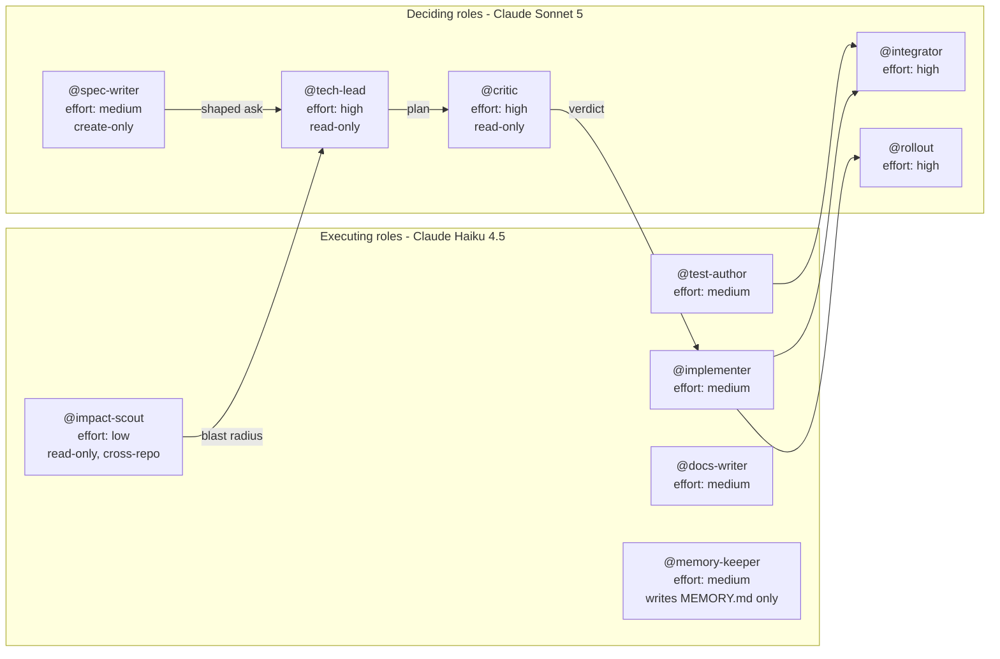

| Role | Job | Boundary | Must report |
|---|---|---|---|
| `@spec-writer` | Turn a vague ask into falsifiable acceptance criteria | Can create one new file, cannot edit existing ones | `OPEN QUESTIONS` - the decisions a human owns |
| `@tech-lead` | Decompose work into slices with interfaces, checks and a rollout order | Read-only | Per slice: files, interface, depends on, done when |
| `@critic` | Attack a plan before it becomes code | Read-only | An explicit verdict: proceed / proceed with changes / rework |
| `@implementer` | Build one slice inside its own file set and branch | Stays inside its file set; reports collisions | `NOT DONE`, `NOTICED, NOT TOUCHED`, `COLLISIONS` |
| `@test-author` | Tests from the spec, never from the implementation | Reads the implementation only to learn how to call it | Behaviours inferred because the spec was silent |
| `@integrator` | Merge parallel branches in one repo and verify the union | Never resolves a conflict it does not understand | Every conflict and how it was resolved |
| `@impact-scout` | Find every consumer of an API across repositories | Read-only; GitHub code search plus local clones | "Not registered but affected" repositories |
| `@rollout` | Sequence a change across repositories and deliver it | Obeys delivery mode; never pushes in `local` | A per-repo table: branch, check, PR, blocked by |
| `@docs-writer` | Keep AGENTS.md, READMEs and ADRs true | Runs every command it documents | What it deleted and why |
| `@memory-keeper` | Maintain the workspace `MEMORY.md` | Writes that one file and nothing else | What it left out and why |

**Deliberately absent**, because the CLI ships them: `@explore`, `@task`,
`@code-review`, `@security-review`, `@rubber-duck`, `@research`. The full
"do not rebuild" table is in [AGENTS.md](../AGENTS.md#do-not-rebuild-these).

**Model and effort bind to the role, not to the run.** `--effort` on a run only
sets the default for an agent that pins nothing, and `check.mjs` fails any
agent in this repository that does. The full assignment and the reasoning
behind each row is in
[copilot-cli-capabilities.md](copilot-cli-capabilities.md#model-and-effort).

---

## 7. Building block: workflows (skills)

A skill is a `SKILL.md` runbook installed to `~/.copilot/skills/`. Copilot CLI
has no custom slash commands, so there is no `/crew`; a skill triggers on the
request itself, or you ask for it by name (*"use the multi-repo skill"*).

| Skill | What it runs | Ends with |
|---|---|---|
| `crew` | **The default entry point.** Find the repo, survey, size, delegate, verify, report | The fixed report block, on a branch. Never pushes. |
| `workspace` | Install or update, correct a check, set delivery mode | A registry you have read |
| `plan` | `@tech-lead` drafts slices, `@critic` attacks them, you get a reviewed plan | A slice table, and `slices.json` if it will be fanned out |
| `harden` | `@code-review`, `@security-review` and `@test-author` in parallel, one ranked list | A verdict: ship / ship after fixes / do not ship |
| `fanout` | The four-part gate, then parallel slices in isolated worktrees | `@integrator` (one repo) or `@rollout` (several) |
| `multi-repo` | `@impact-scout`, one contract, waves, rollout | Ordered, cross-linked delivery |
| `fleet` | Long-running, addressable, supervised sessions | Members you can `say` to, `restart`, or `watch` |

### How `crew` routes a request

`crew` reads down one table and stops at the first row that fits. The rows get
more expensive, and it never climbs a row "for thoroughness".

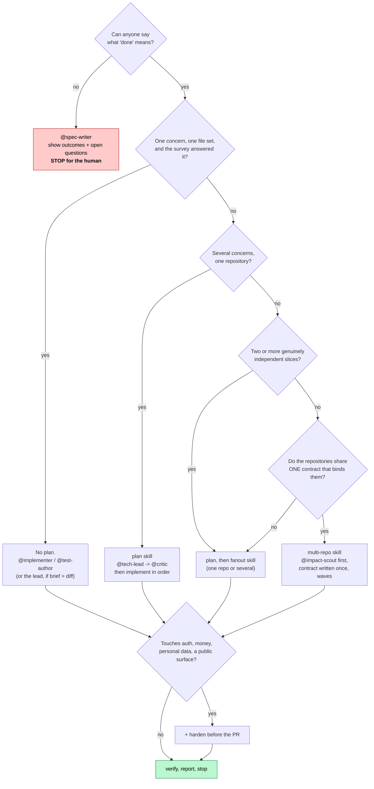

The one distinction people get wrong is the last fork: **count contracts, not
repositories.** Upgrading a dependency in nine repositories is nine independent
slices, which is `fanout`. Changing a type that one repository publishes and
eight consume is `multi-repo`, because landing one without the others breaks
the seam.

---

## 8. Building block: guardrails (hooks)

Hooks are shell commands the CLI runs at fixed lifecycle points, whatever the
model decides. They are the only mechanism here that does not depend on a model
choosing to comply. They are registered at the **user level**
(`~/.copilot/hooks/copilot-base.json`), which is the one kind of hook the CLI
fires in every repository without folder trust.

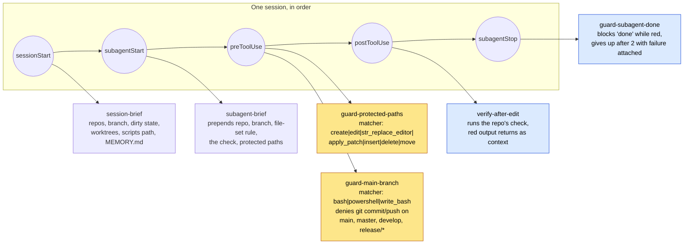

| Hook | Event | Timeout | Effect |
|---|---|---|---|
| `session-brief` | `sessionStart` | 15 s | Injects the workspace or repository brief, the scripts path and `MEMORY.md` (capped at 12,000 characters). In a workspace it also registers the repositories it finds, with a check inferred from each project. |
| `subagent-brief` | `subagentStart` | 15 s | Prepends the non-negotiable rules to every delegated prompt, so a brief that forgot them still carries them. |
| `guard-protected-paths` | `preToolUse` | 15 s | Denies write-shaped tools on any path matching the protected globs, with a reason the agent can act on. |
| `guard-main-branch` | `preToolUse` | 15 s | Denies `git commit` and `git push` on an integration branch. Override only with `COPILOT_BASE_ALLOW_DIRECT=1`, which a human has to set. |
| `verify-after-edit` | `postToolUse` | 320 s | Runs the registered check (300 s budget) after every edit and returns the last 40 lines on failure. Silent in an unregistered repository. |
| `guard-subagent-done` | `subagentStop` | 320 s | Refuses a subagent's completion while the check is red. |

### Two properties every hook here has

**`preToolUse` fails closed.** A hook that throws, or exits non-zero, denies the
tool call. So every entry point is wrapped in `run()` from
[hooks/lib/hook-io.mjs](../hooks/lib/hook-io.mjs), exits `0` unconditionally,
and decides only through what it writes to stdout. A guard that crashed would
otherwise block everything.

**An unregistered repository runs no check.** A machine-wide install must not
run some other project's test suite in a repository you only opened to read.
The two verification hooks stay silent when
[hooks/lib/verify.mjs](../hooks/lib/verify.mjs) finds no command.

### How `guard-subagent-done` avoids trapping an agent

The one guardrail with no equivalent in a prompt is also the one that could
loop forever, so it has an escape hatch.

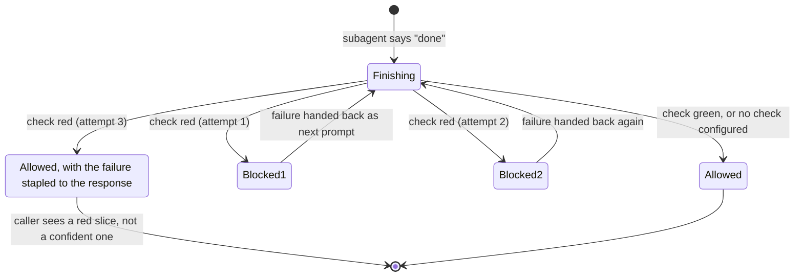

Attempts are counted per agent id in a small state file in the system temp
directory and pruned after six hours, so an id reused later does not start life
already at its limit
([hooks/guard-subagent-done.mjs](../hooks/guard-subagent-done.mjs)).

### The anti-gaming rule

A hook that blocks completion on a red check is exactly the pressure that
produces a gamed check: the cheapest way past it is a deleted assertion or an
added skip. That escape is closed where the enforcement is. Non-negotiable 4 in
[AGENTS.md](../AGENTS.md#non-negotiables) states it, `@implementer` and
`@test-author` restate it, and the rule is: work that cannot pass honestly is
reported failing, with the reason.

---

## 9. Building block: orchestration scripts

Deterministic bookkeeping with no judgement in it does not need a model. These
are zero-dependency Node scripts. After installation they live at
`~/.copilot/copilot-base/scripts/` and are run with that absolute path; inside
this checkout, `node scripts/<name>.mjs` works too.

| Script | Job | Commands |
|---|---|---|
| `install.mjs` | Install, update, uninstall | `--dry-run`, `--uninstall`, `--purge` |
| `repos.mjs` | The repository registry | `scan <dir> [--add]`, `add <path> --verify "..."`, `list`, `set <name> verify\|delivery\|role\|path <value>`, `check [name]`, `remove <name>` |
| `crew.mjs` | Start a crew run from the shell, no session needed | `"<goal>" [--repo <name>] [--bg] [--credits n] [--model m] [--effort e]` |
| `fanout.mjs` | Parallel slices, one worktree and one capped session each, in dependency waves | `run slices.json [--dry-run] [--credits n] [--max-parallel n]`, `report [<run-dir>]` |
| `fleet.mjs` | Named, resumable, supervised sessions | `start`, `list`, `status`, `say`, `restart`, `stop`, `watch` |
| `wt.mjs` | Git worktree helper | `new <branch>`, `ls`, `rm <branch>`, `gc` |
| `check.mjs` | Proves the guardrails behave as documented | (no arguments) |

### How a delegated session is started

Every non-interactive session these scripts spawn gets the same argument set
from `delegatedArgs()` in [scripts/lib/shared.mjs](../scripts/lib/shared.mjs):

```
-p "<prompt>"  --allow-all-tools  --no-ask-user  --output-format json
--deny-tool "shell(git push)"  [--agent <name>]  [--model <m>]  [--effort <e>]
--max-ai-credits <n>  [--share <transcript>]
```

`--allow-all-tools` is required for non-interactive mode. The guardrails come
back in through `--deny-tool` and the hooks, which fire for these sessions too.
The environment carries `GITHUB_COPILOT_PROMPT_MODE_REPO_HOOKS=true` so a
repository's *own* hooks are not silently skipped in prompt mode.

---

## 10. Where state lives, and how facts are resolved

Everything the toolkit needs is under your home directory. Nothing is written
into a work repository.

```
~/.copilot/
├── agents/                      the ten roles
├── skills/                      the seven workflows
├── hooks/
│   └── copilot-base.json        hook registration (absolute paths)
└── copilot-base/
    ├── hooks/                   guard + brief scripts, and lib/
    ├── scripts/                 repos, crew, fanout, fleet, wt, check
    ├── config/
    │   ├── protected-paths      machine-wide protected globs (yours to edit)
    │   └── verify-cmd           fallback check, empty on purpose
    ├── config.json              { "delivery": "local", "credits": 200, ... }
    ├── repos.json               the registry: name, path, verify, role, delivery, protected
    ├── installed.json           the install manifest
    ├── worktrees/<repo>/<branch>/   isolated checkouts for parallel slices
    ├── runs/<stamp>/            one directory per fan-out: BRIEF.md per slice, report.json
    └── fleet/                   state.json, <member>/events.jsonl, result.json, incidents.log

<your workspace folder>/
├── MEMORY.md                    optional; loaded verbatim into every session below it
├── orders-api/                  your checkouts, untouched except for branches and commits
└── billing-api/
```

`COPILOT_HOME` moves the whole `~/.copilot` tree, which is how `check.mjs` and
CI run against a throwaway directory. `COPILOT_BASE_HOME` moves only the
`copilot-base/` part.

### Resolution order for the three per-repository facts

All three are decided in [hooks/lib/config.mjs](../hooks/lib/config.mjs). Most
specific wins, and a worktree resolves to the main checkout it belongs to, so
an agent in a fan-out worktree is never mistaken for one in an unregistered
repository.

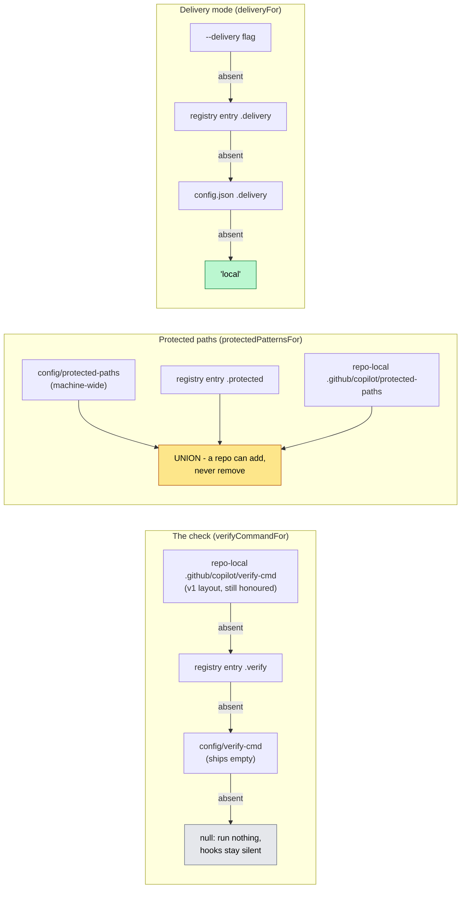

### Zero-setup registration

When a session starts in a folder that holds checkouts, `session-brief` finds
every repository up to two levels down (at most 25), and
[hooks/lib/discover.mjs](../hooks/lib/discover.mjs) proposes a check for each
from what the project itself declares:

| Project declares | Proposed check |
|---|---|
| `package.json` with `typecheck` and/or `test` scripts | `npm run typecheck && npm test` (or `pnpm` / `yarn` if their lockfile is present; `build` stands in for a missing `typecheck`) |
| `pyproject.toml` or `setup.cfg` | `pytest -q` |
| `go.mod` | `go build ./... && go test ./...` |
| `Cargo.toml` | `cargo check --quiet` |
| a `.csproj` or `.sln` | `dotnet build --nologo -v q` |
| nothing runnable | no check; the brief says so out loud |

The rules that keep this from being reckless: it never overwrites an existing
entry, it marks what it guessed with `auto: true` (shown as `[guessed]` in
`repos.mjs list`), and it **writes a command without running one**. Your code
is executed only by the post-edit check, in a repository you edited. Turn it
off with `"autoRegister": false` in `config.json`.

### Memory

`MEMORY.md` beside your checkouts is the only thing here that carries a fact
from one session to the next. `session-brief` walks upward from the session's
folder to find it (stopping at the filesystem root or your home directory) and
injects it verbatim. `@memory-keeper` maintains it: one fact per line, verified
against the code, dated if it can rot, never a secret, never an instruction.

---

## 11. Parallel work: fleet, fan-out and waves

The CLI's `/fleet` runs subagents in parallel, but they **share one working
tree and one HEAD**. That is fine for disjoint files and one combined commit.
It is not fine when each slice needs its own branch, when the check binds
something exclusive (a port, a test database), or when the slices are in
different repositories. That gap is what `scripts/fanout.mjs` fills.

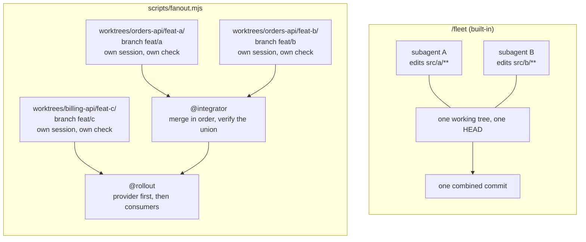

### The gate

`fanout.mjs run` refuses to start if it can see the failure coming. Each of
these is checked, not hoped for ([scripts/fanout.mjs](../scripts/fanout.mjs),
`gate()`):

1. At least two slices. A fan-out of one is pure overhead.
2. Every slice has a name, a brief, and a file set it owns.
3. Every `repo` resolves to a usable git repository, by registry name or path.
4. The agent each slice wants is actually installed.
5. Every `dependsOn` names a slice in this plan, and the graph has no cycle.
6. No two slices **in the same repository** overlap on files. Slices in
   different repositories cannot collide, so they are not compared.
7. No two slices want the same branch in the same repository.

### Waves

`dependsOn` groups slices into waves. Everything in a wave runs in parallel;
the next wave does not start until the current one is green. A red wave stops
the run and the report names what was skipped, because a consumer built against
a broken provider is worse than one never started.

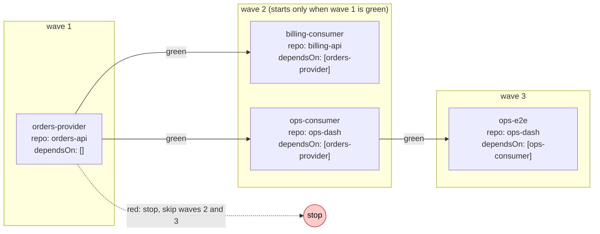

A `slices.json` in the shape the script expects (the `plan` skill writes it for
you):

```json
{
  "notes": "context every brief gets",
  "slices": [
    {
      "name": "orders-provider",
      "repo": "orders-api",
      "dependsOn": [],
      "files": ["src/api/**"],
      "interface": "type User = { id: string; email: string }",
      "doneWhen": "npm test -- api",
      "brief": "One paragraph: what this slice is."
    },
    {
      "name": "billing-consumer",
      "repo": "billing-api",
      "dependsOn": ["orders-provider"],
      "files": ["src/clients/**"],
      "brief": "Adopt the new contract."
    }
  ]
}
```

For each slice the script writes a `BRIEF.md` under
`~/.copilot/copilot-base/runs/<stamp>/<slice>/` containing the file set, the
interface verbatim, the check, and the instruction to stop and report a
collision rather than edit outside the set. `fanout.mjs report` prints the last
run as a table.

### A change across several repositories

`multi-repo` is the wave pattern with the seams moved to repository boundaries,
plus two things a single repository never needs.

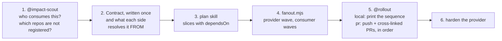

**The interface is a published thing, not a type.** Two repositories cannot
share a type by agreeing to. The contract has to be resolved *from* something
real: a package version, a generated client, a spec file.

**There is no union to verify.** Nothing merges five repositories into one
branch, so `@integrator` has nothing to run. `@rollout` replaces it: the order
held, each consumer verified against the provider, delivery per the configured
mode.

### Fleet: work that outlives a session

[scripts/fleet.mjs](../scripts/fleet.mjs) runs work as **named sessions**
rather than processes to babysit. A Copilot session survives the process that
started it, so a member can be addressed later by name.

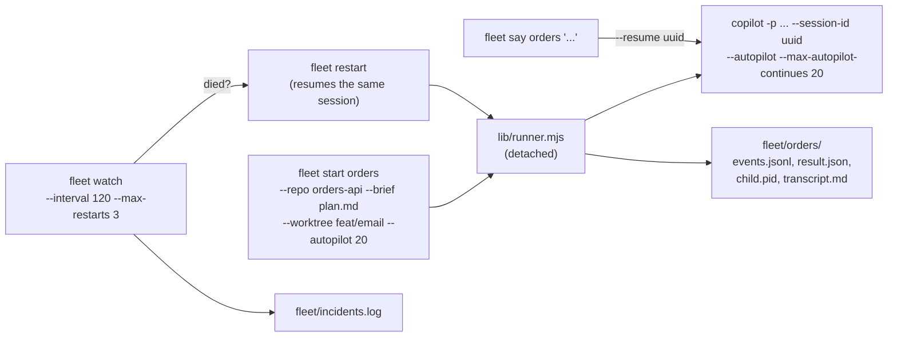

All four preconditions have to hold before this is justified: the work can be
specified once, completion is machine-checkable, there is enough concurrent
work, and the conventions are written down. Members never push; delivery is
`@rollout`'s job.

---

## 12. Delivery: how work leaves the machine

| Mode | Behaviour |
|---|---|
| `local` (default) | Branches and commits. Nothing is pushed. `@rollout` prints the exact push and PR sequence it *would* run. |
| `pr` | Branches pushed, one pull request per repository, opened in dependency order and cross-linked. |

```bash
node scripts/repos.mjs list                          # shows the effective mode per repo
node scripts/repos.mjs set orders-api delivery pr    # one repository
```

The machine-wide default lives in `~/.copilot/copilot-base/config.json`. A
repository you do not own, or one with protected branches, can be pinned to
`local` while everything else opens PRs.

`local` is the default on purpose. Pushing is outward-facing and awkward to
undo, so it is something you turn on, not something you discover happened.
Changing that default is one of the three things that needs a human
conversation rather than a pull request
([CONTRIBUTING.md](../CONTRIBUTING.md#things-that-need-a-human-not-a-pull-request)).

---

## 13. Safety guarantees

What the toolkit promises about your machine and your repositories, and where
each promise is kept.

| Guarantee | How it is kept |
|---|---|
| **Writes to exactly two places:** `~/.copilot/` and `~/.copilot/copilot-base/` | `install.mjs` records every path in a manifest; `--dry-run` lists them before anything is written |
| **Never writes inside a work repository** except branches and commits | Worktrees, briefs, run reports and fleet state all live under `~/.copilot/copilot-base/`; the registry lives outside the repositories |
| **Never commits to `main`, `master`, `develop` or `release/*`** | `guard-main-branch`, a `preToolUse` hook; override requires a human to set `COPILOT_BASE_ALLOW_DIRECT=1` |
| **Never edits a protected path** without a human decision | `guard-protected-paths`; per-repo lists can add to the global list but never weaken it |
| **Never reports done on a red check** | `guard-subagent-done` blocks the completion; the lead re-runs the check itself in `crew` step 5 |
| **Never makes a check pass by weakening it** | Non-negotiable 4 in `AGENTS.md`, restated in `@implementer` and `@test-author` |
| **Never runs your code in a repository you only opened to read** | An unregistered repository has no check; registration writes a command and never runs one |
| **Never pushes or opens a PR by default** | Delivery mode resolves to `local`; delegated sessions also carry `--deny-tool "shell(git push)"` |
| **Never commits work it did not make** | `crew` and `@implementer` check for pre-existing dirty files before staging, and report them instead |
| **Never leaves a repository on a branch it did not find it on** | A branch created for work that did not happen is deleted and the original branch restored |
| **Every spawned session has a credit cap** | `--max-ai-credits` on every delegated run, default 200 from `config.json` |
| **A guard that crashes cannot fail open** | Every hook exits 0 and decides through stdout; `check.mjs` tests this |

### The one configuration that looks broken

Autopilot with the permission prompt declined. The CLI stops asking, nothing is
approved, and almost every shell command and file edit comes back
`Permission denied and could not request permission from user`, while reads
keep working. Fix it with `/allow-all` in the session, or start with
`copilot --autopilot --allow-all-tools`. Granting it does **not** switch the
guardrails off: they are hooks, they fire whatever the permission mode is, and
a hook `deny` beats `--allow-all-tools`.

---

## 14. How it is tested

One command, and it must pass before anything is called done:

```bash
node scripts/check.mjs
```

[scripts/check.mjs](../scripts/check.mjs) creates throwaway git repositories
and a throwaway `COPILOT_HOME`, then exercises the real code paths: each guard's
allow and deny decisions, path canonicalisation (Windows short names and
junctions included), config resolution, the fan-out gate and wave ordering, the
installer and uninstaller, and the structural validity of every agent and skill
the CLI would load, including that every agent pins both a model and an effort.
It touches nothing real.

CI ([.github/workflows/guardrails.yml](../.github/workflows/guardrails.yml))
runs it on **Ubuntu and Windows** on every pull request and every push to
`main`, because the shell and path assumptions differ and Windows is where they
break.

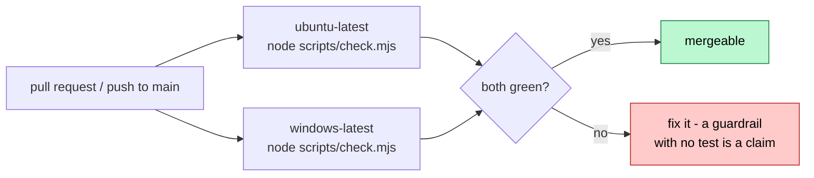

---

## 15. The adoption ladder

Do not start at the top. Each stage has an entry condition, and skipping stages
produces the elaborate-but-useless setup this toolkit exists to prevent.

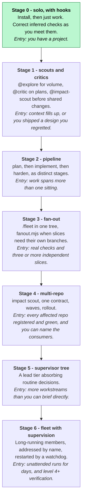

Most solo builders and small teams live productively at stages 0 to 2 and reach
for 3 occasionally. Stage 4 is where a team with several services actually
lives, and its entry condition is bookkeeping (a registry and green checks)
rather than anything clever.

**The metric** for whether any of it is working: are you writing *fewer*
messages than before? If your message count is going up, roll back down the
ladder.

---

## 16. Command cheat sheet

Inside this checkout, `node scripts/<name>.mjs` works. Everywhere else, use the
installed path that the session brief prints: `node ~/.copilot/copilot-base/scripts/<name>.mjs`.

**Setup**

```bash
node scripts/install.mjs --dry-run
node scripts/install.mjs
copilot skill list
node scripts/check.mjs
```

**Everyday**

```bash
copilot                                       # in the folder that holds your projects
copilot --autopilot --allow-all-tools         # long unattended stretch; say yes to the prompt
node scripts/crew.mjs "implement user story ABS-312"
```

**Registry and checks**

```bash
node scripts/repos.mjs list
node scripts/repos.mjs scan D:/work --add
node scripts/repos.mjs set orders-api verify "npm run typecheck && npm test"
node scripts/repos.mjs check
```

**Parallel and multi-repo**

```bash
node scripts/fanout.mjs run slices.json --dry-run
node scripts/fanout.mjs run slices.json
node scripts/fanout.mjs report
node scripts/wt.mjs gc --repo orders-api
```

**Fleet**

```bash
node scripts/fleet.mjs start orders --repo orders-api --brief plans/orders.md --worktree feat/email --autopilot 20
node scripts/fleet.mjs list
node scripts/fleet.mjs say orders "the User schema changed - rebase onto main and adjust"
node scripts/fleet.mjs watch --interval 120 --max-restarts 3
```

**Delivery**

```bash
node scripts/repos.mjs set orders-api delivery pr
```

**Remove**

```bash
node scripts/install.mjs --uninstall           # keeps settings and registry
node scripts/install.mjs --uninstall --purge   # removes those too
```

---

## 17. Glossary

| Term | Meaning here |
|---|---|
| **Role / agent** | A `*.agent.md` definition, installed to `~/.copilot/agents/`, invoked with `@name`. Runs as a subagent with its own context window, model, effort and tool set. |
| **Workflow / skill** | A `SKILL.md` runbook, installed to `~/.copilot/skills/`, loaded into the main agent's context. Orchestrates roles. Asked for by name; there are no custom slash commands. |
| **Hook** | A command the CLI runs at a lifecycle event (`sessionStart`, `preToolUse`, ...). Deterministic; independent of what the model decides. |
| **The check** | The one shell line that proves a repository still works. Comes from the registry, runs after every edit and before a subagent may finish. |
| **Registry** | `~/.copilot/copilot-base/repos.json`: name, path, check, role, delivery mode and extra protected paths per repository. The only source of per-repo facts. |
| **Workspace** | The folder that holds your checkouts. A session started there gets a brief of everything below it, and `MEMORY.md` beside the checkouts is loaded verbatim. |
| **Session brief** | What `session-brief` injects at `sessionStart`: repositories, stacks, branches, dirty counts, checks, the scripts path, memory. |
| **Slice** | One unit of delegated work: a name, a repository, a file set it owns, an interface it must satisfy, a runnable "done when", a brief. |
| **Wave** | A group of slices with all dependencies satisfied. Waves run in order; a red wave stops the run. |
| **Worktree** | A separate git checkout sharing one object store. Gives a parallel slice its own branch and its own check run. Lives under `~/.copilot/copilot-base/worktrees/`. |
| **Contract** | In multi-repo work, the interface written once and resolved *from* something real (a package version, a generated client, a spec file). |
| **Provider / consumer** | The repository that publishes a contract, and the ones that depend on it. Providers run in an earlier wave. |
| **Delivery mode** | `local` (branches and commits only, the default) or `pr` (push and open cross-linked pull requests in order). |
| **Inferred check** | A check proposed from what a project declares, marked `[guessed]`. Never invented; never overwrites a hand-set one. |
| **Fleet member** | A named, resumable Copilot session started by `fleet.mjs`, addressable with `say`, supervised by `watch`. |
| **`<base>`** | `~/.copilot/copilot-base`, the installed copy. Skills write commands as `node <base>/scripts/...`; the session brief prints the real path. |
| **Fails closed** | A `preToolUse` hook that crashes denies the call. Every hook here exits 0 and decides only via stdout, so a bug cannot become a blanket block. |
